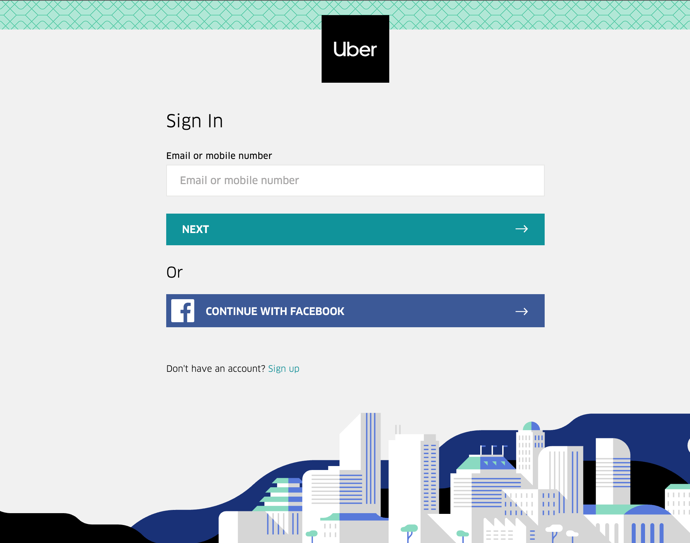
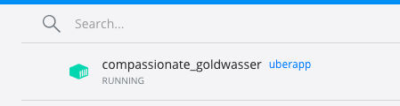

# DevOps-The-Hard-Way-Azure LAB 

In this lab I will be setting up a real world environemnt using Devops technologies and practices for deploying application in Microsoft Azure. 

The solution is to deploy the Uber API for the sign-up page. Currently this solution is sitting on a bunch of baremetal, but it's time to sprinkle a little DevOps on it.

 Thank you thomast1906 for creating this amazing guide :) 

Technologies consists: Azure, GitHub, Python, Terraform, Dockter , Kubernetes, CI/CD and Automated Testing 

I did this by doing the following 

Prerequisites- Azure Account, Azure Cli, Terraform, Docker Desktop  and GitHub (store the source code)

1) Start Studio code and create a project called Devops-The-Hard-Way-Azure and initialize the folder by running git init command and publish the project to Github Repo. You also need to download the Github Extension in VBS before you publish it.  

2) Run the create-terraform-storage.sh in the azure folder to Create Storage Account and Resource Group for Terraform State file. I did this by running the script in bash cloud shell in visual studio code.

3) Create Azure AD Group  and AZ login details for AKS Admins by running the create azure terraform-storage.sh in th azure folder which will create the cluster 

4) Terraform - create all of the Azure cloud services you'll need from an environment (Readme/Terrform-Azure/Readme.md)

Docker - create a Docker image from the app, containerise it, and store the container inside of a container repository

8) Create a docker image by running the command docker build -t uberapp . in the docker folder. This will create a docker image locally on your docker desktop. Once created, to check the image has been creted running the docker image ls. Run docker run -tid uberapp command in order to run the docker container locally and to view it has been create type docker container ls. 

  

9) Push Docker image to ACR - In your local machine login to CLI by typing az login and athenicate to your azure account and type  az acr login --name devopsthehardway202acr to login to your ACR. When your login tag the Docker image by running the docker tag uberapp devopsthehardway202acr.azurecr.io/uberapp:v1 before pushing it to your ACR. You can push it by running this docker push docker push devopsthehardway202acr.azurecr.io/uberapp:v1.  

Kubernetes - This section will connect to AKS locally and to write the Kubernetes manifest to deploy the Python Uber app.

10) Login to AKS - To login to the Kubernetes you need to run az aks get-credentials --resource-group devopsthehardway-rg --name devopsthehardwayaks. This will create a kube/config file locall for you.  After you have sucessfully login to your AKS, you can view the nodes have running the kubectl get node. 

11) Create Kubernetes Manifest - To create the manifest and deploy it to AKS you will need to go to the Kubernetes folder and go to the deployment.yml and edit line with your ACR container registry name.  The Kubernetes manifest will consist of the following components:

The deployment
The service
The Application Gateway Ingress
The deployment is what gets the application running in Kubernetes

This service is what exposes the Kubernetes application so you can reach the frontend from a load balancer hostname or IP.
